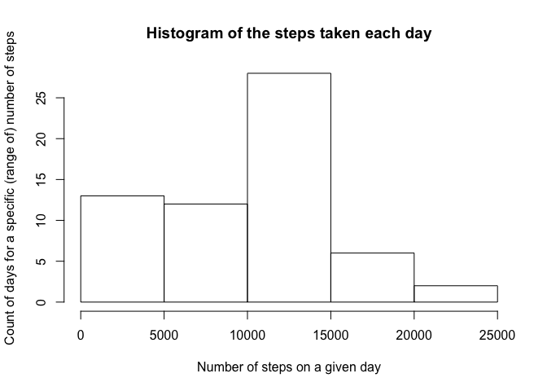
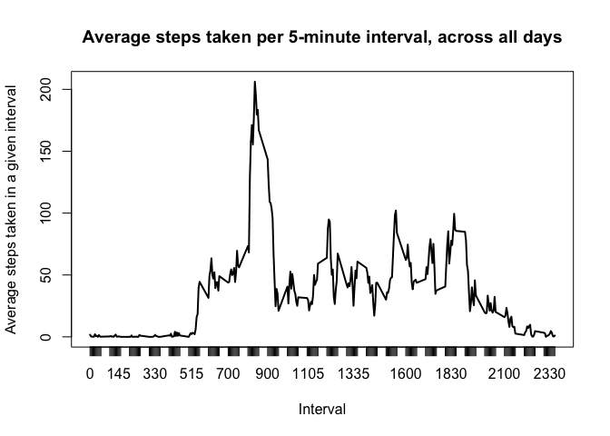
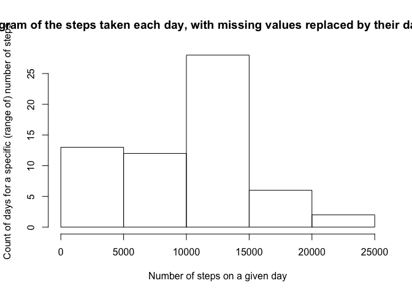
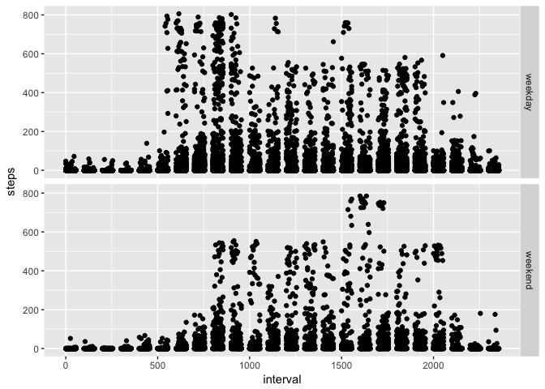

# Reproducible Research: Peer Assessment 1


## Loading and preprocessing the data

```r
    activity_data <- read.csv("activity.csv", colClasses = c("integer", "Date", "integer"))
```

```
## Warning in strptime(xx, f <- "%Y-%m-%d", tz = "GMT"): unknown timezone
## 'zone/tz/2018c.1.0/zoneinfo/Europe/Berlin'
```


## What is mean total number of steps taken per day?
1. Calculate the total number of steps taken per day

```r
    steps_per_day <- aggregate(activity_data["steps"], by = activity_data["date"], sum, na.rm = TRUE)
```


2. Make a histogram of the total number of steps taken each day

```r
    hist(steps_per_day$steps,
         main = "Histogram of the steps taken each day", 
         ylab = "Count of days for a specific (range of) number of steps", 
         xlab = "Number of steps on a given day")
```

<!-- -->


3. Calculate and report the mean and median of the total number of steps taken per day

```r
    paste("The mean of steps_per_day is", mean(steps_per_day$steps), "and the median of steps_per_day is", median(steps_per_day$steps))
```

```
## [1] "The mean of steps_per_day is 9354.22950819672 and the median of steps_per_day is 10395"
```

## What is the average daily activity pattern?

1. Make a time series plot (i.e. 𝚝𝚢𝚙𝚎 = "𝚕") of the 5-minute interval (x-axis) and the average number of steps taken, averaged across all days (y-axis)

```r
    interval_data <- as.table(with(activity_data, tapply(steps, as.factor(interval), mean, na.rm=TRUE)))
    plot(interval_data, type="l", main="Average steps taken per 5-minute interval, across all days", xlab = "Interval", ylab = "Average steps taken in a given interval")
```

<!-- -->

2. Which 5-minute interval, on average across all the days in the dataset, contains the maximum number of steps?

```r
    paste("The interval with the maximum number of steps across all days is", names(which.max(interval_data)))
```

```
## [1] "The interval with the maximum number of steps across all days is 835"
```


## Imputing missing values

Note that there are a number of days/intervals where there are missing values (coded as 𝙽𝙰). The presence of missing days may introduce bias into some calculations or summaries of the data.

1. Calculate and report the total number of missing values in the dataset (i.e. the total number of rows with 𝙽𝙰s)

```r
    paste("The number of missing step data / intervals is", sum(is.na(activity_data$steps)))
```

```
## [1] "The number of missing step data / intervals is 2304"
```

2. Devise a strategy for filling in all of the missing values in the dataset. The strategy does not need to be sophisticated. For example, you could use the mean/median for that day, or the mean for that 5-minute interval, etc.


```r
    i = 1
    while(i <= length(activity_data$steps)) {
        if(is.na(activity_data$steps[i])) {
            activity_data[i,]$steps <- steps_per_day[match(activity_data[i,]$date, steps_per_day$date),2]
            i <- i + 1
        }
        else {
            i <- i + 1
        }
    }
```

3. Create a new dataset that is equal to the original dataset but with the missing data filled in.

```r
    activity_data_na2mean <- activity_data
    activity_data <- read.csv("activity.csv", colClasses = c("integer", "Date", "integer"))
```

4. Make a histogram of the total number of steps taken each day and Calculate and report the mean and median total number of steps taken per day. Do these values differ from the estimates from the first part of the assignment? What is the impact of imputing missing data on the estimates of the total daily number of steps?


```r
    steps_per_day_na2mean <- aggregate(activity_data_na2mean["steps"], by = activity_data_na2mean["date"], sum, na.rm = TRUE)
    hist(steps_per_day_na2mean$steps,
         main = "Histogram of the steps taken each day, with missing values replaced by their day's mean", 
         ylab = "Count of days for a specific (range of) number of steps", 
         xlab = "Number of steps on a given day")
```

<!-- -->

```r
    paste("The mean number of steps taken per day is", mean(steps_per_day_na2mean$steps))
```

```
## [1] "The mean number of steps taken per day is 9354.22950819672"
```

```r
    paste("The median number of steps taken per day is", median(steps_per_day_na2mean$steps))
```

```
## [1] "The median number of steps taken per day is 10395"
```

```r
    paste("The difference in mean with imputing missing values is", mean(steps_per_day_na2mean$steps) - mean(steps_per_day$steps))
```

```
## [1] "The difference in mean with imputing missing values is 0"
```

```r
    paste("The difference in median with imputing missing values is", median(steps_per_day_na2mean$steps) - median(steps_per_day$steps))
```

```
## [1] "The difference in median with imputing missing values is 0"
```

## Are there differences in activity patterns between weekdays and weekends?


```r
    library(ggplot2)

    activity_data$weekdays <- weekdays(activity_data$date)
    
    is.weekday <- function(day) {
        any(day==c("Monday", "Tuesday","Wednesday", "Thursday","Friday"))
    }
    
    i=1
    while(i<=length(activity_data$weekdays)) {
       if(is.weekday(activity_data$weekdays[i])) {
           activity_data$is_weekday[i] <- "weekday"
       }
        else {
            activity_data$is_weekday[i] <- "weekend"
        }
        i <- i+1
    }
    
    qplot(interval, steps, data = activity_data, facets = is_weekday ~ ., na.rm = TRUE)
```

<!-- -->

Yes, there are differences in activity patterns between weekdays and weekends. On weekdays, there seems to be more activity towards the beginning of the day, between intervals 500 - 1000. On weekends, the activity is shifted towards the end of the day, i.e. between intervals 1500 and 1750.
